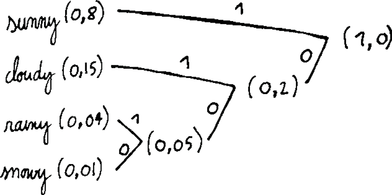

# Entropy

_Entropy_ measures the uncertainty of a RV.  
For a discrete RV $X$ with alphabet \(\mathcal{X}\) and PMF \(p(x)\), its entropy is 

$$
\begin{align}
H(X) &= \mathbb{E}\left[\log_2\frac{1}{p(X)}\right]
&= -\sum_{x\in\mathcal{X}} p(x) \log_2 p(x)
\end{align}
$$
measured in _bits_ (can also be measured in _nats_ using natural log instead of log base 2).  
It is the expected number of (optimal) yes/no questions to identify the outcome.  
Similarly, in communication, it is the minimum average number of bits to encode the outcome.  
It is the expected value (over all outcomes) of \(-\log_2 p(x)\), which is the information (or "suprisal") of getting that outcome.

Case of \(n\) equiprobable outcomes

$$
\begin{align}
H(X) &= -\sum_{i=1}^n = \frac{1}{n}\log_2\left(\frac{1}{n}\right) \\
&= - \log_2\left(\frac{1}{n}\right) \\
&= \log_2 n
\end{align}
$$
which is the number of bits required to encode  \(n\) different outcomes.

### Weather example - Huffman coding

Consider the following example with \(\mathcal{X}=\left\lbrace \text{sunny}, \text{cloudy}, \text{rainy}, \text{snowy} \right\rbrace\) with repsective probabilities \(0.8, 0.15, 0.04, 0.01\). Entropy is 

$$
\begin{align}
H(X) &= 0.8\log_2(0.8) + 0.15\log_2(0.15) + 0.04\log_2(0.04) + 0.01\log_2(0.01) \\
&= 0.92 \text{ bits}
\end{align}
$$

It is lower than 1, because most of the time, you would correctly guess the weather without even asking a single question.

If you were to communicate a weather forecast, the most efficient code can be obtained by Huffman coding method:
- order all outcomes by decreasing probabilities
- repeatedly link the two lowest probabilities and sum their values
- labels all upper and lower branches with ones and zeros

{: style="display: block; margin: 0 auto; width: 300px"}

| weather | \(p\) | code | \(N\) (nb of bits for encoding) | \(p\cdot N\) |
| :------ |:-----:|:-----| -------------------------------:|:------------:|
| sunny   | 0.8   | 1    | 1                               | 0.8          |
| cloudy  | 0.15  | 10   | 2                               | 0.3          |
| rainy   | 0.04  | 100  | 3                               | 0.12         |
| snowy   | 0.01  | 000  | 3                               | 0.03         |
| *sum*   | 1.0   |      |                                 | 1.25         |

The expected number of bits (entropy) to transmit the message is 1.25 bits.