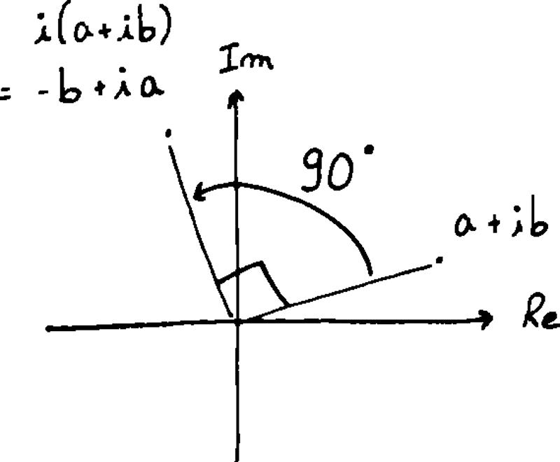
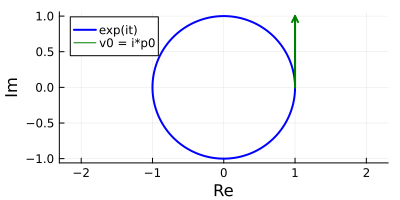
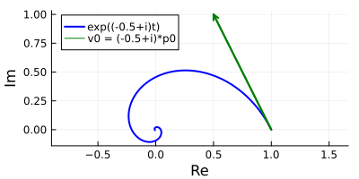

# Laplace transform
Many of the stuff here is from [3b1b videos](https://www.youtube.com/watch?v=p_di4Zn4wz4&list=PLZHQObOWTQDNPOjrT6KVlfJuKtYTftqH6).
#### Complex numbers
A complex number can be described either in cartesian or polar coordinates
$$
s = a+ib = r \cos(\theta) + i\sin(\theta)
$$
In the complex plane, multiplying by a real value scales up or down, and multiplying by an imaginary value rotates
{: style="display: block; margin: 0 auto; width: 250px"}

#### Exponential

It is the unique function which has its derivative equal to its value, and maps 0 to 1.
$$
\frac{d}{dt}e^x = e^x
$$
It converts sums to products $e^{x+y} = e^x e^y$
<!-- It can also be defined as the sum
$$
e^x = 1 + x + \frac{x^2}{2!}+ \frac{x^3}{3!} + \ldots = \sum_{n=0}^\infty \frac{x^n}{n!}
$$ -->

#### Complex exponential for dynamical systems
Consider the different systems evolving with position in time $p=e^{st}$, with different $s$:

- $p=e^t$, the velocity at any instant is equal to the position, thus the position increases exponentially

- $p=e^{-0.5t}$, the velocity is half the position, with opposite sign, $v=-0.5e^{-0.5t}$, thus the position decreases with an exponential decay

- $p=e^{it}$, the velocity is at 90 deg with the position, with unit length, $v=ie^{it}$, thus the position rotates on the unit circle
{: style="display: block; margin: 0 auto; width: 400px"}

- $p=e^{(-0.5+i)t}$, the velocity is $v=(-0.5+i)e^{(-0.5+i)t}=-0.5p + ip$, thus the position rotates and decays towards 0 (spiraling to 0).
{: style="display: block; margin: 0 auto; width: 400px"}
 

