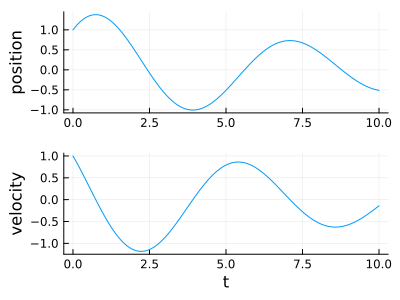

# Linear system example: mass-spring-damper
This is an example for [linear dynamical systems note](linear_dynamical_systems.md).

The classic mass-spring-damper linear system is
$$
m\ddot{z} = -c\dot{z}-kz
$$

and in state-space form,

$$
\begin{pmatrix}
\dot{z} \\
\ddot{z}
\end{pmatrix}
=\begin{pmatrix}
0 & 1\\
-\frac{k}{m} & -\frac{c}{m}
\end{pmatrix}
\begin{pmatrix}
z\\
\dot{z}
\end{pmatrix}
$$

Eigenvalues and eigenvectors are such that

$$
\begin{align}
Av &= \lambda v\\
(A-\lambda I)v &= 0\\
\begin{pmatrix}
-\lambda & 1\\
-\frac{k}{m} & -\frac{c}{m}-\lambda
\end{pmatrix}
v&=0
\end{align}
$$

From the first line of the equation, the eigenvectors have the form \(v = \begin{pmatrix}1\\ \lambda \end{pmatrix}\).  
Furthermore, it must be that \(A-\lambda I\) is singular so its determinant is null,

$$
\begin{align}
\det(A-\lambda I) &= 0\\
-\lambda(-\frac{c}{m}-\lambda) + \frac{k}{m} &= 0\\
\lambda^2 + \lambda \frac{c}{m} + \frac{k}{m} &= 0\\
(\lambda + \frac{1}{2}\frac{c}{m})^2 - \frac{1}{4}{c^2}{m^2} + \frac{k}{m} &= 0\\
\lambda + \frac{1}{2}\frac{c}{m} &= \pm\sqrt{\frac{1}{4}\frac{c^2}{m^2}-\frac{k}{m}}\\
\lambda &= \frac{-c\pm\sqrt{c^2-4mk}}{2m}
\end{align}
$$

which can result in complex eigenvalues if \(c^2 < 4mk \).
For example, if \(m=1\), \(k=1\), \(c=0.2\),

$$
\begin{align}
\lambda_{1} &= -0.1 + 0.99i \quad & \lambda_{2} &= -0.1 - 0.99i\\
v_1 &= \begin{pmatrix} 1\\ -0.1 + 0.99i\end{pmatrix} & v_2 &= \begin{pmatrix} 1\\ -0.1 - 0.99i\end{pmatrix}
\end{align}
$$

The solution is of the form 

$$
x(t) = c_1e^{\lambda_1 t}v_1 + c_2e^{\lambda_2 t}v_2
$$

Choosing \(c_{1,2} = a \pm i b\) leads to \(c_2\), \(e^{\lambda_2 t}\) and \(v_2\) being complex conjugates of \(c_1\), \(e^{\lambda_1 t}\) and \(v_1\). As conjugation is distributive over multiplication, the product \(c_2e^{\lambda_2 t}v_2\) is the complex conjugate of \(c_1e^{\lambda_1 t}v_1\), and since we then add these two complex conjugates, the imaginary parts cancel out.

The two unknowns \(a\) and \(b\) are identified from intial conditions \(z(0)=1\) and \(\dot{z}(0) = 1\),

$$
\begin{align}
c_1 v_1 + c_2 v_2 &= \begin{pmatrix} 1\\ 1\end{pmatrix} \\
(a+ib) \begin{pmatrix} 1 \\ -0.1+0.99i\end{pmatrix} + (a-ib) \begin{pmatrix} 1 \\ -0.1-0.99i\end{pmatrix} &= \begin{pmatrix} 1\\ 1\end{pmatrix}
\end{align}
$$

From the first line, \(a=\frac{1}{2}\). Injecting it in the second line gives \(b=-0.555\).

$$
\begin{align}
x(t)&=e^{-0.1t}\left((a+ib)(\cos(0.99t)+i\sin(0.99t))v_1 + (a-ib)(\cos(0.99t)-i\sin(0.99t))v_1\right)\\
&= e^{-0.1t}\left((v_1+v_2)\left( a\cos(0.99t)-b\sin(0.99t) \right) + i(v_1-v_2)\left(a\sin(0.99t)+b\cos(0.99t)\right)\right)\\
&= e^{-0.1t}\left(\begin{pmatrix}2\\-0.2\end{pmatrix}\left( a\cos(0.99t)-b\sin(0.99t) \right) + i\begin{pmatrix}0\\1.98i\end{pmatrix}\left(a\sin(0.99t)+b\cos(0.99t)\right)\right)\\
&= e^{-0.1t}\left(\begin{pmatrix}2\\-0.2\end{pmatrix}\left( 0.5\cos(0.99t)+0.555\sin(0.99t) \right) - \begin{pmatrix}0\\1.98\end{pmatrix}\left(0.5\sin(0.99t)-0.555\cos(0.99t)\right)\right)
\end{align}
$$

{: style="display: block; margin: 0 auto; width: 400px"}


#### Simulation in Julia
```julia
using ControlSystems, Plots

# System parameters
m, k, c = 1.0, 1.0, 0.2

# State-space representation
A = [0 1; -k/m -c/m]
B = [0; 1/m]
C = [1 0]
D = 0
sys = ss(A, B, C, D)

# time, initial conditions, controller
t = 0:0.01:10
x0 = [1.0, 1.0]
u(x,t) = [0] # controller function must return a vector

# Simulation
result = lsim(sys, u, t, x0=x0)

# Plot
plot(result, plotu=false, plotx=false)
```
