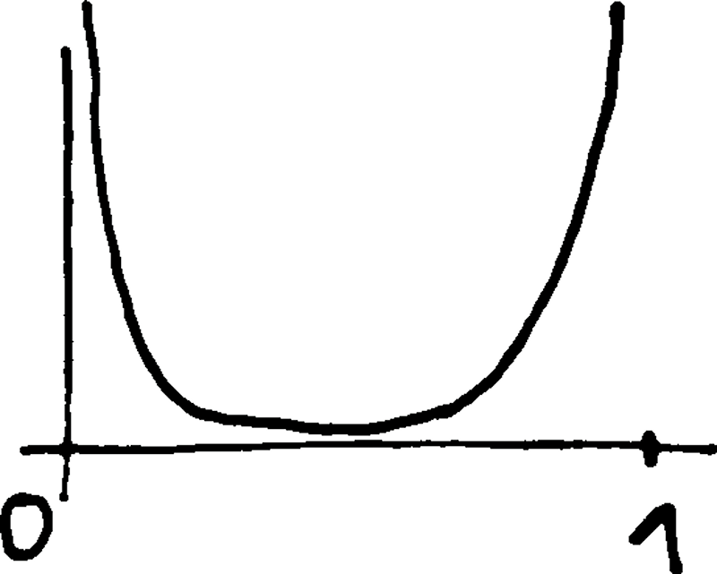
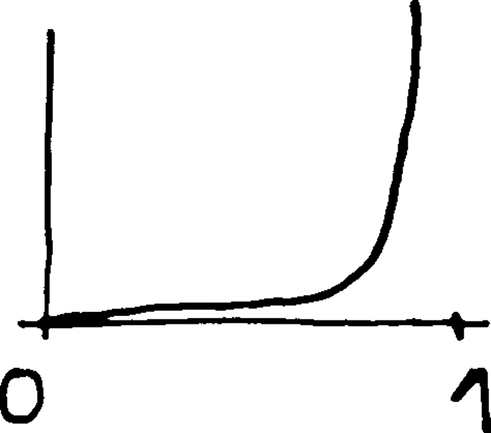
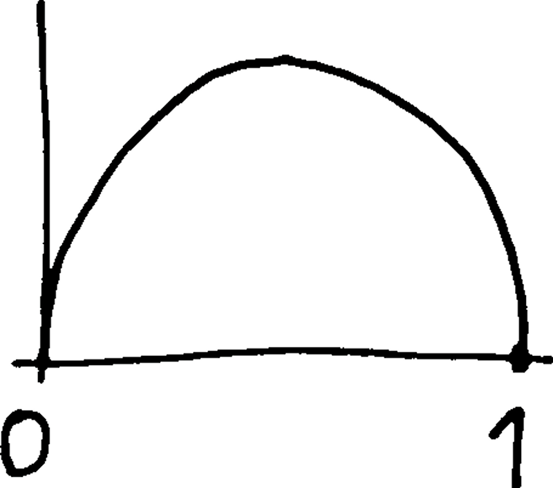
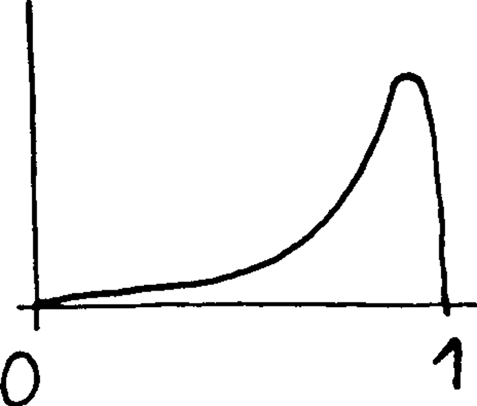

# Bayesian inference for Bernoulli random variables

Beta distribution is the _prior conjugate_ for a Bernoulli RV.  
Here the likelihood $P(e|H)$ corresponds to $P(x|p)$ ($p$ is the model parameter, $x$ the experimental outcome).  
For $x\in\left\lbrace 0; 1\right\rbrace$ (either success or fail, yes or no, etc.).

$$
P(X=x) = p^x (1-p)^{1-x}
$$

The simplest and most useful conjugate prior is $p\sim\text{Beta}(\alpha,\beta)$ with PDF

$$
P(p) = p^{\alpha-1}(1-p)^{\beta-1}
$$

because after multiplication we get

$$
\begin{align}
P(p|x) &\propto p^x (1-p)^{1-x} p^{\alpha-1} (1-p)^{\beta-1} \\
&= p^{\alpha+x-1} (1-p)^{\beta+(1-x)-1}
\end{align}
$$

which has the same form as the prior, $p\sim\text{Beta}(\alpha+x,\beta+(1-x))$.  
Success ($x=1$) gives a posterior $\text{Beta}(\alpha+1,\beta)$.  
Failure ($x=0$) gives a posterior $\text{Beta}(\alpha,\beta+1)$.  
Hence $\alpha$ and $\beta$ act as pseudo-counts for the number of successes and failures.

Jeffreys prior is \(\text{Beta}\left(\frac{1}{2},\frac{1}{2}\right)\).  
Here is an idea of successive PDF:

| \(\alpha\) | \(\beta\) | PDF |
|---|---|---|
| 0.5 | 0.5 | {: style="display: block; margin: 0 auto; width: 100px"} |
| 1.5 | 0.5 | {: style="display: block; margin: 0 auto; width: 100px"} |
| 1.5 | 1.5 | {: style="display: block; margin: 0 auto; width: 100px"} |
| 10.5 | 1.5 | {: style="display: block; margin: 0 auto; width: 100px"} |