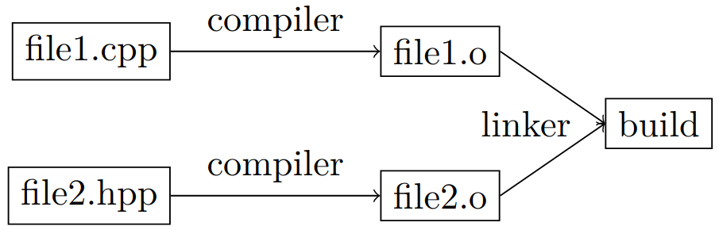

# C++
Most of the notes here are from reading the book _Programming Principles and Practice Using C++_ from Bjarne Stroustrup.


## Hello World
Create a file `helloworld.cpp` with
```cpp
#include <iostream>

int main() {
    std::cout << "Hello, World!\n";
    return 0;
}
```
It imports the standard library for input output
streams (in namespace `std`). Then, the `main` function
is declared: in every C++ program, it is the function
called at execution. Every function (here `main`) has
a return type (`int`), a name (`main`), a parameter list
(empty) and a body enclosed by curly braces.

In C++, source code has the extension .cpp, object
code (output of compiler) has extension .obj on Windows and .o on Linux, and executable has extension
.exe on Windows and no extension on Linux.

{: style="display: block; margin: 0 auto; width: 300px"}

To compile (on linux) and then execute,
```cpp
g++ helloworld.cpp -o helloworld
./helloworld
```
where `-o` is used to specify the output file name. Additional flags can be passed, for example
```
g++ helloworld.cpp -o helloworld -O2 -g -Wall
```
where `-g` allows debuggers like GDB to map executable code back to source code, and `-Wall` enables compiler warnings. `-O2` specifies the level of optimization,

- `-O0`: no optimization (default)
- `-O1`: Basic optimization
- `-O2`: Optimization recommended for release build
- `-O3`: Maximum optimization (rarely introduces bugs)
- `Os`: Optimizes for executable code size


### Makefile
A Makefile is a file named `Makefile` with no extension, in the source folder. It contains compilation rules with a target (executable to be created ,`hello`), dependencies (other files the target depends on) and compilation command.

#### Example 1
```makefile
hello: hello.c
	gcc hello.c -o hello
```

#### Example 2
```makefile
CC = gcc
CFLAGS = -Wall -g -O2

helloworld: helloworld.c
	$(CC) $(CFLAGS) hello.c -o hello

clean:
	rm -f helloworld
```
where `CC` and `CFLAGS` are variables to define the compiler to use and compilation flags. `clean` is a special target for deleting the exectuable.  
Executing `make` in the source directory compiles `helloworld.cpp`.  
Executing `make clean` deletes the executable.  
See also [itsfoss article on compilation](https://itsfoss.gitlab.io/post/how-to-compile-and-run-c-c-program-in-ubuntu/).

## Declaration, definition and scope
### Declaration
A declaration introduces a name into a scope, and specifies its type (and input parameters for a function), it does not allocate memory. Names can only be used after having been declared, otherwise the compilation fails.
A forward declaration is used for example when multiple functions call on another and it is impossible to define functions before they are used.
```cpp
double fcn2(); // forward declaration of fcn2
double fcn1(); // definition of fcn1
{
    // computations...
    fcn2(); // call to fcn2
}
double fcn2() // definition of fcn2
{
    // computations...
    fcn1(); // call to fcn1
}
```
### Definition
A definition is a declaration that also fully describes the entity declared (e.g. a variable with its initialization value, a function with its computation).

### Scope
A scope restricts the use of variables, functions, etc. to limited portions of the program. Some examples are

- The _global scope_ is the part of code outside any
other scope.
- A _namespace_, defined as
```cpp
namespace MyNamespace
{
    class MyClass
    {
    public:
      void DoSomething() {}
    };
    void Func(MyClass) {}
}
```
and used as
```cpp
MyNamespace::MyClass ob1;
ob1.DoSomething();
MyNamespace::Func(ob1);
```
or if no clash is expected with other names,
```cpp
using namespace MyNamespace
MyClass ob1;
ob1.DoSomething();
Func(ob1);
```
it is however best practice to not include too many namespaces with `using` directives.
- A function body is a _local scope_, it includes its parameter names.
- A class definition, in which names can be used before their declaration, and their accessibility is further controlled by `public`, `private` and `protected` keywords.
- Statement block in `for`, `while`, `if` or `switch`
- Blocks `{ ... }`

## Common types of variables
_Variables_ are named data stored in memory. Variables have a specific _type_ that determines what kind of values it can hold, and which operators can be applied to it. In this section, only _built-in_ types are covered, while _user-defined_ types are adressed later (_classes_ and _enumerations_). Good practice is to always initialize variables (except for strings, automatically initialized empty).
```cpp
int nb_steps = 40; // integers
double length = 22.5; // floating-point number
char decimal_pt = ’.’; // individual character
string usr_name = "John"; // character string
bool stop = false; // logical variable
constexpr double pi=3.14159 // cannot be changed,
must be known at compile time
const double c3=n // cannot be changed
auto maxiter = 100; // auto type deduction (int)
```

_Constants_ are variables whose value cannot change,
they have to be initialized with their value. Use
`constexpr` if it is known at compile-time, or `const`
if it is known at execution and then never changes.
```cpp
constexpr double pi = 3.14159; // compile-time const
const int nb_max = 7; // run-time const
const int nb_max {7}; // alternative synthax
```

## Operations on types bool, char, int, double, string
For all of these, we have operations
```cpp
int a = 40; // assignement
b = double{a}; // widening conversion
cin >> a; // read from cin into a
cin << a; // write a to cout
b = f(a); // function call
b = f<T>(a); // function template call
int sq = [](int x){return x^2}; // lambda expr
c = x==y; // equals
c = x!=y; // not equal
c = x>y; // greater than, also >=, <, <=
c = !x; // not
```
`bool` have other logical operators
```cpp
a&&b; // logical and
a||b; // logical or
```
Such comparisons are evaluated left-to-right.  
`int` and `double` have operations +, -, *, /, and
```cpp
a = x+y; // also -, *, /
x++; // pre-increment (also x--)
++x; // post-increment (also --x)
x+=n; // add n (also -,*,/)
```
`int` types have also the modulo operator `%` to compute the remainder `x%y` of a division `x/y`, such that `(x/y)*y+x%y=x`
```cpp
a = x%y; // remainder of division x/y
x%=n; // remainder of divison by n
```
`string` types have the concatenation operation
```cpp
c = "John" + " " + "Doe"; // concatenation
x+= " Doe"; // append (add to end)
```

## Vectors
Vectors are used to store sequences of elements. Best practice is to use vectors instead of arrays to avoid out-of-range access.
```cpp
vector<int> age = {3,9,1};
vector<string> animals = {"cat","dog","mouse"}
vector<double> heights(3); // size 3, init empty
vector<double> heights(3,0.0); // size 3, init to 0
vector<strings> names(3); // size 3, init to ""
age[0]; // access first element
age.size(); // nb of elements, 3
age[age.size()-1]; // access last element
// loop over elements
for (int i=0, i<animals.size(); ++i) {
    cout << animals[i] << ’\n’;
}
for (string x :animals) { // for each x in animals
    cout << x << ’\n’;
}
```
It is possible to use vectors without specifying a size, it is then initialized to an empty vector.
```cpp
vector<int> v;
for (int i; cin>>i;)
    v.push_back(i); // i is placed at the end of v
```

## If and switch statements
The easiest form of selection is the `if` statement
```cpp
if (check1)
    statement 1;
else if (check2) {
    statement 2;
    statement 3;
}
else
    statement 4;
```
If a selection needs to execute more than one statement, a block should be used, delimited by curly braces `{ }`.  
An _arithmetic if_ or _conditional expression_ is a shorter
if-else statement
```cpp
double abs_a = (a>=0) ? a : -a;
```
To compare an `int`, `char` or `enumeration` efficiently
against several constants, use the `switch` statement
```cpp
switch(unit_char) {
case ’m’:
    cout<<"meters\n";
    break;
case ’N’: case ’n’:
{
    cout<<"Newton\n";
    double Pressure = Force/Area;
    break;
}
default:
    cout<<"\n";
    break;
}
```
Do not forget break statements !  
Also, if some statements of a `case` define new variables, a block `{ }` should be used.

## While and for loops
As for `if` statement, `for` and `while` loops either contain a single statement, or a block of multiple statements inside curly braces `{ }`.  
The general loop statement is the `while` statement
```cpp
int i=0; // init control variable to start at 0
while (i<100) { // condition for stop
    std::cout << i << ’\t’ << i*i << ’\n’;
    ++i; // increment control variable i
}
```
For iterating over a sequence of numbers, the `for` statement has better readability and takes care of the control variable `i` at the top
```cpp
for (int i=0; i<100; ++i) {
    std::cout << i << ’\t’ << i*i << ’\n’;
}
```
Both `for` and `while` can contain operations to execute in their statement. Consider the following example, which indefinitely add doubles provided by the user, until any other character (other than a number or “.”) is entered (in which case `cin>>num_to_add` returns `false`).

```cpp
double sum = 0;
for (double num_to_add; cin>>num_to_add;) {
    sum += num_to_add;
}
```
```cpp
double sum = 0;
double num_to_add = 0;
while (cin>>num_to_add) {
    sum += num_to_add;
}
```

## Functions
A function declaration consists of a return type (`void` if it returns nothing), followed by its name, a list of parameters in parenthesis and ended by a semi-colon. A function definition is the function declaration plus the function body containing all computations. Function nesting is not legal in C++.
```cpp
int square(int v); // declaration
int square(int v) // definition
{
    return v*v;
}
```
Arguments can be passed

- by value, giving the function a copy of the vari-
able, hence initializing a local variable in the
function’s body
- by const reference (avoids copying the variable)
```cpp
int square(const int& v)
{
    return v*v;
}
```
where `&` is the reference operator (`int& v` is the memory address of variable `v` that has type `int`), and `const` ensures the functions does not modify the value stored at that address.
- by reference (variable can be modified)
```cpp
void swap(double& d1, double& d2)
{
    double temp = d1; // copy value stored at d1 to temp
    d1 = d2; // copy value stored at d2 to d1
    d2 = temp; // copy temp to d2
}
```
swaps the two values stored at `d1` and `d2`.

#### Compile-time function evaluation
A function is evaluated at compile-time if it is declared as `constexpr` and its arguments are `constexpr`. A function declared as `constexpr` used with normal arguments behaves like any other function. If a function should only be evaluated at compile-time, declare it as consteval.
```cpp
constexpr pi = 3.14159; // global constexpr
constexpr double circ_area(double r)
{
    return pi*r*r;
}
int main(){
    constexpr double fixed_r = 1.5;
    double var_r = 0.5;
    cin >> var_r;
    constexpr double fixed_a = circ_area(fixed_r);
    double var_a = circ_area(var_r); // run-time eval
}
```

#### Suffix return type notation
An alternative declaration synthax is the trailing return notation, in
which the return type is introduced after the function name.
```cpp
double circ_area(double r) {return pi*r*r;} // classic
auto circ_area(double r) -> double {return pi*r*r;}
```

## Errors
Errors are categorized depending on when and how they are detected

- _Compile-time error_ (either _synthax error_ or _type error_) found by the compiler for language rules violation;
- _Link-time errors_ found by the linker trying to combine object files into an executable;
- _Run-time errors_ found during program execution, either by
    - computer (hardware or OS)
    - a library
    - user code (ex. using exceptions) called _Logic errors_
    - user (sees computer crashing, unrealistic output)

To detect errors, the mecanism of exceptions can be used. When a called function or code block detects an error, it throws an expection with an error message, which can be catched by any code executed later (e.g. the code calling the function), using a `try` block. An error message is returned using `cerr` instead of `cout`.
```cpp
#include <iostream>
#include <stdexcept>
double division(double a, double b){
    if (b == 0)
        throw std::runtime_error("Division by zero not allowed!");
    return a/b;
}
int main()
{
    try {
        // computations
        r = division(a,b);
        // computations
        return 0; // indidates success
    }
    catch (runtime_error& e) {
        std::cerr << "runtime err:" << e.what()<<’\n’;
        return 1; // indicates failure
    }
}
```

## Class
Classes implement user-defined types. It uses built types, other user-defined types and functions. _Members_ of a class are either data members or function members, accessed using the notation `obj.member`. A variable constructed using a class is an _object_ of that class.

### Private vs public
`private` and `public` parts of a class distinguishes what should be accessible by external code or class members only. It is best pratice to keep data members private, so users cannot mess with it.

### Constructor
A _constructor_ is a special member function with the same name as the class. It is used to initialize a class object.

### Where to define member functions ?
Member functions can be defined either within the class definition, or outside. If it is defined within, the compiler generates code in each place the function is called (as _inline_ functions), instead of using function-call instructions, leading to performance improvement. In general, only member function of less than 5 lines are defined within.

### Constant objects
To allow for immutables objects (constant variables), we have to precise which member functions does not change the object by appending `const` after the list of parameters. Only these functions are allowed to be executed on an object declared as `const`.
```cpp
class Date {
public:
    // interface to external code
    class Invalid {}; // class def to catch errors
    Date(int y, int m, int d) // constructor
    {
        :_y{y}, _m{y}, _d{d}; // init members
        if (!is_valid())
            throw Invalid{};
    }// alternatively, _y = y; etc.
    void add_day()
    void print_year()
private:
    // accessed only by class members
    int _y, _m, _d;
};
// different file or portion of code
bool Date::is_valid() // return true if date is valid
{
    return 1<=m && m<=12; // very incomplete check
}
void Date::add_day()
{
    ++_d;
}
void Date::print_year() const
{
    cout << _y << ’\n’;
}
```
Then the class is used as
```cpp
try{
    Date today {16, 04, 2025}; // initialization
    Date today(16, 04, 2025); // init old version
    const Date revolution{14, 07, 1789}; // immutable
    revolution.print_year();
    revolution.add_day(); // error: not for const obj
}
catch(Date::Invalid){
    std::cerr << "invalid␣date" <<’\n’
}
```

### Constructor and destructor
To avoid cumber some memory allocation with `new` and `delete`, constructor and destructor methods are defined in the class. When the object goes out of scope or `delete` is used, either the defined destructor is called, or if none exists, one is automatically generated to call the destructors of each member.
```cpp
class vectorbis {
public:
    vectorbis(int s);
    ∼vectorbis() { delete[] elem; }

    int size() const { return sz; }
    double get(int n) const { return elem[n]; } //read
    void set(int n, double v) { elem[n] = v; } // wite
private:
    int sz; // size
    double* elem; // pointer to elements
};
vectorbis::vectorbis(int s)
    :sz{s}, elem{new double[s]} // init members
{
    for (int i=0; i<s; ++i)
        elem[i] = 0;
}
```

### Identifier `this`
In a class member function, this is a pointer to the object for which the member function is called.

## Structure
A structure is the same as a class with all its members public.
```cpp
struct Date {
    class Invalid {}; // class def to catch errors
    int _y, _m, _d;
    Date(int y, int m, int d) // constructor
    void add_day(int n)
};
```

## Enumeration
In C++11, `enum class` is defined, it is a list of values, treated as symbolic constants. It automatically associates every enumerator to an integer (default is 0 then it increments from there, or initialize first then it increments, or initialize all but not recommended).
```cpp
enum class Month { // "enum struct" is the same
    jan=1, feb, mar, apr, may, jun, jul, aug, sep,
    oct, nov, dec
};
Month m = Month::feb;
if m==Month::jan
    std::cout << "happy new year" <<’\n’
next_m = m+1; // error, not possible
next_m = Month{(int)m +1}; // cast to int, +1, convert
```
`enum class` are separate types from `int`, hence op-
erations mixing enumerators and integers are allowed
without a cast.  
Old-school `enum` is less strict (more prone to prob-
lems) with no scope restriction and an implicit con-
version to `int`.
```cpp
enum Month {
    jan=1, feb, mar, apr, may, jun, jul, aug, sep,
    oct, nov, dec
};
Month m = feb; // Month m = Month::feb also OK
if m==1
    std::cout << "happy new year" <<’\n’
next_m = m+1; // OK
```

## Operator overloading
C++ operators can be extended for class or enumeration operands.
```cpp
Month operator++(Month& m) // for prefix increment ++
{
    m = (m==Month::dec) ? Month::jan : Month{(int)m + 1};
    return m;
}
```

## Pointers
Memory addresses of variables can be stored and manipulated. An object holding an address is a pointer.
```cpp
int var = 17;
int* ptr = &var; // ptr holds the address of var
int* ptr2 = new int; // allocate
int* ptr2 = new int{18}; // allocate and initialize
double* p = new double[4]; // allocates memory for 4 doubles and returns pointer to the first element
double* p = new double[]{0,1,2,3}; // alloc + init
double x1 = *p; // read first element by dereferencing
double x2 = p[0]; // same
double y = p[2]; // read third element
*p = 7.7; // write to first element pointed to by p
p[0] = 7.7; // same
```
The null pointer `nullptr` is used when no initialization is possible.  
The number of objects (length of vector here) allo-
cated by the `new` operator can be set at run-time.  
Pointers to class objects use either `->` or dereferencing `*` plus `.` to access members,
```cpp
vector <int>* p = new vector<int>{1,2,3};
cout << p->size(); // access member function
cout << ( *p).size();
```
Deallocation to free memory space is done with
`delete` operator. Forgetting to delete an object cre-
ated by `new` is called a _memory leak_.
```cpp
double* r = new double[10];
double* a = new double;
// computations
delete a;
delete[] r; // use [] for arrays
```

### `unique_ptr`
This smart pointer (_ressource management pointer_) `unique_ptr` automatically calls delete on a pointer that goes out of scope.  
Best practice is to only have `new` and `delete` in constructors and destructors, and use resource-management classes, such as `vector`, `unique_ptr`, etc.

### `shared_ptr`

_To complete_

#### `span`
`span` is a pointer that also keeps track of the number of elements pointed to.

## Reference
A reference is quite similar to a pointer, only it is automatically dereferenced when used, and it must be initialized, and cannot be re-assigned (it always refer to the same variable).
```cpp
int i=3;
int *ptr = &i; // ptr stores addr of i
int &ref = i; // reference to i
```

## Templates
A _template_ is a mechanism that enables to use types as parameters for a class or a function. The compiler then generates a specific class or function when the type is specified.

### Function template example
```cpp
template <typename T> T myMax(T x, T y) {
    return (x > y) ? x : y;
}
int main() {
    std::cout << myMax<int>(3, 7) << std::endl;
    std::cout << myMax<double>(3.0, 7.0) << std::endl;
    std::cout << myMax<char>(’g’, ’e’);
    return 0;
}
```

### Class template example
```cpp
template <typename T1, typename T2>
class testclass {
    public:
    T1 x;
    T2 y;
    testclass(T1 val1, T2 val2) :
    x(val1), y(val2) {}
    void getValues() {
    cout << x << " " << y;
}
};
int main() {
    Geek<int, string> intStringGeek(10, "Hello");
    Geek<char, bool> charBoolGeek(’A’, true);
    intStringGeek.getValues(); // 10 Hello
    cout << endl;
    charBoolGeek.getValues(); // A 1
    return 0;
}
```

<!-- Continue from page 807 -->